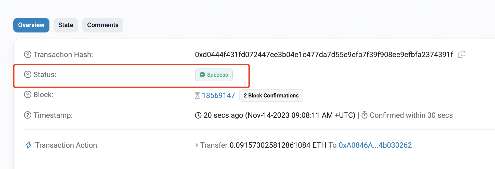

# 确认交易

在上一节中，发送完交易，程序就直接退出了，至于交易是否确认，需要我们去区块浏览器里查看才知道。这显然不够好，我们应该等待交易确认，然后检查实际结果是成功还是失败。

以太坊网络每15秒才能出一个块，我们可以使用
```go
_, isPending, err := ec.TransactionByHash(ctx, txHash)
```
来检查交易的状态。

如果`isPending`变成了`false`，那么交易要么是成功了，要么是失败了，都结束了`Pending`状态。

然后我们再次查询交易详细信息，检查一下具体的状态是成功还是失败即可
```go
receipt, err := ec.TransactionReceipt(ctx, txHash)
```
返回的对象`receipt`包含`Status`，`0`表示失败，`1`表示成功。这与Etherscan浏览器上面的显示一致。


不过，由于区块链网络的特殊性，有时候交易会很长时间得不到确认，所以我们最好设置一定的超时时间，比如最多等10分钟就不等了（当然，这是示例教程，实际项目中必须谨慎处理）。

至此，我们把所有功能集合到一起，封装起来作为一个功能函数，每秒钟检查一次，直到超时或者用户主动停止，看交易是否还在`Pending`。如果结束`Pending`了，就查询具体的`Status`看看到底成功失败。
```go
func waitConfirm(ctx context.Context, ec *ethclient.Client, txHash common.Hash, timeout time.Duration) error {
	pending := true
	for pending {
		select {
		case <-ctx.Done():
			return ctx.Err()
		case <-time.After(timeout):
			return errors.New("timeout")
		case <-time.After(time.Second):
			_, isPending, err := ec.TransactionByHash(ctx, txHash)
			if err != nil {
				return err
			}
			if !isPending {
				pending = false // break `for`
			}
		}
	}
	receipt, err := ec.TransactionReceipt(ctx, txHash)
	if err != nil {
		return err
	}
	if receipt.Status == 0 {
		msg := fmt.Sprintf("transaction reverted, hash %s", receipt.TxHash.String())
		return errors.New(msg)
	}
	return nil
}
```

除了等待的代码，其他代码和上一节一样，只是也顺便封装到一个函数里了。

## 完整代码
```go
package main

import (
	"context"
	"crypto/ecdsa"
	"errors"
	"fmt"
	"github.com/ethereum/go-ethereum/common"
	"github.com/ethereum/go-ethereum/core/types"
	"github.com/ethereum/go-ethereum/crypto"
	"github.com/ethereum/go-ethereum/ethclient"
	"log"
	"math/big"
	"os"
	"time"
)

func main() {
	apiKey := os.Getenv("INFURA_API_KEY")
	url := "https://sepolia.infura.io/v3/" + apiKey
	ec, err := ethclient.Dial(url)
	if err != nil {
		log.Fatalf("could not connect to Infura with ethclient: %s", err)
	}
	ctx := context.Background()

	pk, err := crypto.HexToECDSA(os.Getenv("PRIVATE_KEY"))
	if err != nil {
		log.Fatalf("load private key error: %s", err)
	}

	to := common.HexToAddress("0x26a1DDA0E911Ea245Fc3Fb7C5C10d18490942a60")
	amount := big.NewInt(100_000_000_000_000_000) // 0.1 ether

	hash, err := sendEth(ctx, ec, pk, to, amount)
	if err != nil {
		log.Fatalf("send Ether error: %s", err)
	}
	log.Printf("tx sent, hash: %s", hash)
	if err = waitConfirm(ctx, ec, *hash, time.Minute*10); err != nil {
		log.Fatalf("wait confirmation error, please check the tx by yourself: %s", err)
	}
	log.Printf("tx %s confirmed", hash)
}

func sendEth(ctx context.Context, ec *ethclient.Client, pk *ecdsa.PrivateKey, to common.Address, amount *big.Int) (*common.Hash, error) {
	chainId, err := ec.ChainID(ctx)
	if err != nil {
		return nil, err
	}
	address := crypto.PubkeyToAddress(pk.PublicKey)
	log.Printf("account: %s", address)

	nonce, err := ec.NonceAt(ctx, address, nil)
	if err != nil {
		return nil, err
	}
	log.Printf("nonce: %d", nonce)
	header, err := ec.HeaderByNumber(ctx, nil)
	if err != nil {
		return nil, err
	}
	log.Printf("base fee: %s", header.BaseFee)
	gasTipCap, err := ec.SuggestGasTipCap(ctx)
	if err != nil {
		return nil, err
	}
	log.Printf("Suggested GasTipCap(maxPriorityFeePerGas): %s", gasTipCap)
	txData := &types.DynamicFeeTx{
		ChainID: chainId,
		Nonce:   nonce,
		To:      &to,
		Value:   amount,
		Gas:     21000,

		GasFeeCap: header.BaseFee,
		GasTipCap: gasTipCap,
	}
	signedTx, err := types.SignNewTx(pk, types.LatestSignerForChainID(chainId), txData)
	if err != nil {
		return nil, err
	}
	err = ec.SendTransaction(ctx, signedTx)
	if err != nil {
		return nil, err
	}
	hash := signedTx.Hash()
	return &hash, nil
}

func waitConfirm(ctx context.Context, ec *ethclient.Client, txHash common.Hash, timeout time.Duration) error {
	pending := true
	for pending {
		select {
		case <-ctx.Done():
			return ctx.Err()
		case <-time.After(timeout):
			return errors.New("timeout")
		case <-time.After(time.Second):
			_, isPending, err := ec.TransactionByHash(ctx, txHash)
			if err != nil {
				return err
			}
			if !isPending {
				pending = false // break `for`
			}
		}
	}
	receipt, err := ec.TransactionReceipt(ctx, txHash)
	if err != nil {
		return err
	}
	if receipt.Status == 0 {
		msg := fmt.Sprintf("transaction reverted, hash %s", receipt.TxHash.String())
		return errors.New(msg)
	}
	return nil
}
```

祝朋友们玩得开心～